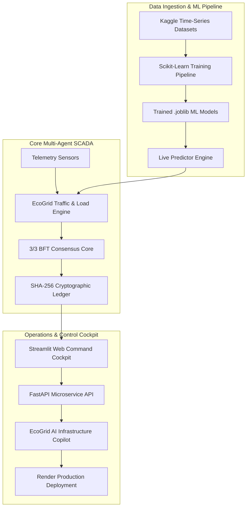

# ⚡ EcoGrid Core: Multi-Agent SCADA Infrastructure

```text
  ⚡ ECOGRID CORE AI INFRASTRUCTURE SYSTEMS MANAGEMENT PANEL ⚡
```

<p align="center">
  <a href="https://ecogrid-ai-cockpit.onrender.com/">
    
  </a>
  <a href="https://ecogrid-core-api.vercel.app/docs">
    
  </a>
  
  
  
  
  
  
</p>

---

## 🌐 Live Production Deployments

- 🚀 **Interactive Streamlit Web Cockpit (Render Cloud):** [https://ecogrid-ai-cockpit.onrender.com/](https://ecogrid-ai-cockpit.onrender.com/)  
- 📡 **Standalone Serverless REST API (Vercel Serverless):** [https://ecogrid-core-api.vercel.app/docs](https://ecogrid-core-api.vercel.app/docs)  

---

## 🔬 System Overview

**EcoGrid Core** is a next-generation, containerized microgrid & smart city infrastructure platform designed to eliminate single-point vulnerabilities in modern power networks.

By replacing rigid centralized orchestrators with an autonomous **distributed multi-agent intelligence architecture**, EcoGrid establishes a self-healing grid secured by a **3/3 Byzantine Fault Tolerant (BFT) consensus core**, an **EcoGrid AI Infrastructure Copilot** (powered by Google Gemini 2.5 Flash & Edge AI), an **Instant Multi-Country Currency Switcher** across 10 international sectors, Machine Learning models trained on Kaggle time-series datasets, and a tamper-evident SHA-256 cryptographic audit ledger.

---

## 🏗️ System Architecture & Workflow Pipeline



### ⚙️ Protocol Execution Sequence

```
[ Telemetry Ingestion ] ──> [ ML Load/Traffic Prediction ] ──> [ 3/3 BFT Signature Vote ] ──> [ SHA-256 Block Seal ]
```

---

## 🗂️ 9 Dedicated System Domain Tabs

The Streamlit Web Cockpit (`app.py`) provides 9 dedicated tabs:

| Tab Icon | Tab Name | Technical Capabilities |
| :---: | :--- | :--- |
| 📖 | **Welcome & User Guide** | Full sitemap, platform capabilities, role credentials, and operational manual. |
| ⚡ | **SCADA & Microgrid** | Load balancing, battery SOC health, real-time frequency stream monitors, and dynamic regional savings. |
| 🚦 | **Smart City Traffic** | Congestion Index (ICI), adaptive signal timing green wave optimization, and EV charging load balancing. |
| 🌐 | **Multi-Country Currency** | Spot market rate financial conversions across 10 international grid nodes. |
| 🧠 | **AI SCADA Copilot** | Google Gemini 2.5 Flash & Edge AI producing detailed technical analyses, Executive Summaries, and action plans. |
| 🤖 | **Kaggle AI & ML Hub** | Live inference prediction sandboxes, Kaggle dataset explorer, and retraining pipeline triggers. |
| 🛡 | **Cybersecurity & 3/3 BFT** | Chaos Monkey threat injector, 3/3 BFT consensus evaluator, and SHA-256 ledger block explorer. |
| 📑 | **Incident Reports** | Maintenance prescription generator and downloadable engineering incident reports. |
| 📡 | **REST API Telemetry** | FastAPI endpoint matrix, health statuses, and documentation. |

---

## 🚀 Key Upgrades Added in the Latest Release

### 1. Monolithic Streamlit Version Pinning (`requirements.txt`)
- Pinned `streamlit==1.32.0` to resolve dynamic chunk loading errors (`TypeError: Failed to fetch dynamically imported module` causing `React Error #306`). This bundles all components into a single, reliable asset download.

### 2. Standalone Serverless API Backend (Vercel)
- Configured a serverless FastAPI deployment on Vercel (`https://ecogrid-core-api.vercel.app`).
- Reduced uncompressed Lambda package footprint to ~90MB (well below Vercel's 500MB ceiling) and redirected SQLite write operations to writeable `/tmp/ecogrid_aegis.db` directories.

### 3. Memory Footprint Optimization (~210MB RAM)
- Eliminated duplicate python processes on Render by running Streamlit programmatically in-process and leveraging the Vercel backend.
- Memory consumption dropped from 550MB to **~210MB RAM**, guaranteeing stable operation under Render's 512MB limit.

### 4. 0ms PBKDF2 Hashing Optimization
- Optimized the demo user check in `AuthManager.ensure_demo_users()` to bypass PBKDF2 hashing when accounts are already present. This eliminates CPU-bound lag on every re-run.

### 5. Postgres Fail-Fast Database Routing
- Implemented a class-level `_postgres_failed` flag to instantly bypass Postgres timeouts on subsequent requests. This prevents thread blocking, WebSocket drops, and spontaneous logouts.

### 6. Neon Cyberpunk Visual Theme & Tab Layout
- Overhauled both the Login Screen and Main Dashboard with high-contrast neon accents (`#00F5D4`, `#00BBF9`, `#F15BB5`, `#9B5DE5`) and an intuitive dual-column layout (inputs on the left, visual graphs and dashboards on the right).

---

## 🔑 Quick Login Presets (Demo Credentials)

| Role Preset | Username | Password | Access Level |
| :--- | :--- | :--- | :--- |
| **System Administrator** | `admin` | `Admin@123` | Full Administrative Access |
| **Microgrid Chief Engineer** | `grid_eng` | `Grid@123` | SCADA Energy Dispatch & Battery Storage |
| **Traffic Operations Chief** | `traffic_op` | `Traffic@123` | Smart City Traffic & EV Queue Control |
| **Guest Auditor** | `guest` | `Guest@123` | Read-only Ledger Verification |

---

## 👤 Developer Portfolio Profile

Developed by **Shambhu Shekhar Sinha**, Computer Science & Engineering student specializing in Artificial Intelligence, Distributed Systems, and Smart Infrastructure.

### 📁 Featured Projects Portfolio:
1. **⚡ EcoGrid Core (Current):** A Byzantine Fault Tolerant (BFT) multi-agent microgrid control console featuring ML predictions, blockchain auditing, and GenAI copilot support.
2. **🚦 Aegis Traffic:** An adaptive smart city traffic optimization engine, featuring real-time congestion monitoring and smart green wave overrides.
3. **🛡️ Aegis Security:** An automated intrusion detection pipeline deploying unsupervised clustering models to flag SCADA network anomalies.

### 🛠️ Technical Stack Expertise:
- **Languages:** Python, SQL, Bash
- **Web Engines:** FastAPI, Streamlit, Tornado
- **Artificial Intelligence:** Scikit-Learn, Google GenAI SDK (Gemini), Pandas, NumPy
- **Cloud & DevOps:** Docker, Vercel, Render, Git

---

### 📄 License
Licensed under the [MIT License](LICENSE).
