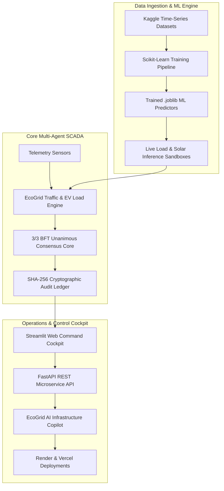

# ⚡ EcoGrid Core: Enterprise Multi-Agent SCADA Infrastructure

```text
  ⚡ ECOGRID CORE AI SCADA INFRASTRUCTURE COMMAND COCKPIT v6.5-PROD ⚡
```

<p align="center">
  <a href="https://ecogrid-ai-agent.streamlit.app/">
    
  </a>
  <a href="https://ecogrid-core-api.vercel.app/docs">
    
  </a>
  
  
  
  
  
  
  
  
</p>

---

## 🌐 Live Production Systems & API Endpoints

- 🚀 **Interactive Streamlit Command Cockpit (Streamlit Cloud):**  
  👉 [https://ecogrid-ai-agent.streamlit.app/](https://ecogrid-ai-agent.streamlit.app/)

- 📡 **Serverless OpenAPI Swagger Documentation (Vercel Backend):**  
  👉 [https://ecogrid-core-api.vercel.app/docs](https://ecogrid-core-api.vercel.app/docs)

---

## 🔬 System Overview

**EcoGrid Core** is an enterprise-grade, containerized microgrid and smart city SCADA infrastructure command cockpit designed to eliminate single-point vulnerabilities in modern energy grids and urban transport networks.

By replacing rigid centralized orchestrators with an autonomous **distributed multi-agent intelligence architecture**, EcoGrid establishes a self-healing microgrid secured by a **3/3 Byzantine Fault Tolerant (BFT) consensus engine**, an **AI SCADA Infrastructure Copilot** (powered by Google Gemini 2.5 Flash & Edge AI), an **Instant 0ms Multi-Country Currency Switcher** across 10 global sector nodes, Machine Learning predictors trained on time-series Kaggle datasets, and a tamper-evident SHA-256 cryptographic block ledger.

---

## 🏗️ System Architecture & Workflow Pipeline



### ⚙️ Telemetry Execution Sequence

```text
[ Telemetry Ingestion ] ──> [ ML Load/Traffic Inference ] ──> [ 3/3 BFT Signature Vote ] ──> [ SHA-256 Block Ledger Seal ]
```

---

## 🗂️ 10 Right-Hand Side System Domain Tabs

The main dashboard features 10 right-hand side tabs, engineered for instant client-side switching without session reruns or logouts:

| Tab Icon | Tab Name | Key Technical Capabilities |
| :---: | :--- | :--- |
| 📖 | **User Guide** | Complete system sitemap, platform capabilities, role credentials, and operational manual. |
| ⚡ | **SCADA Grid** | Real-time BFT microgrid load balancing, sine-wave frequency stream monitors, battery SOC health, and regional savings. |
| 🚦 | **Smart Traffic** | Intersection Congestion Index (ICI), adaptive green-wave signal timing, and EV queue load shedding. |
| 🌐 | **Currency Matrix** | Instant 0ms spot market rate financial conversions across 10 international grid nodes. |
| 🧠 | **AI Copilot** | Google Gemini 2.5 Flash & Edge AI producing detailed technical analyses, Executive Summaries, and action plans. |
| 🤖 | **Kaggle ML Hub** | Live inference prediction sandboxes, Kaggle dataset explorer, and automated retraining pipeline triggers. |
| 🛡️ | **3/3 BFT Security** | Chaos Monkey threat injector, 3/3 BFT consensus evaluator, and SHA-256 ledger block explorer. |
| 📑 | **Incident Reports** | Maintenance prescription generator and downloadable engineering incident reports. |
| 📡 | **REST API Telemetry** | FastAPI endpoint matrix, service health statuses, and Swagger documentation links. |
| 📂 | **Data & File Inspector** | Safe file viewer, dataset browser, and CSV/JSON uploader with zero data loss protection. |

---

## 🌐 Instant Multi-Country Currency Localization Matrix

EcoGrid Core supports instant **0ms O(1)** financial conversion and utility tariff evaluation across 10 international grid sectors:

| Sector Code | Country | Currency | Symbol | Base Tariff (/kWh) | INR Conversion Ratio |
| :---: | :--- | :---: | :---: | :---: | :---: |
| **IN** | India | INR | ₹ | ₹7.50 | 1.0000 |
| **US** | United States | USD | $ | $0.18 | 0.0120 |
| **EU** | European Union | EUR | € | €0.24 | 0.0110 |
| **UK** | United Kingdom | GBP | £ | £0.35 | 0.0093 |
| **JP** | Japan | JPY | ¥ | ¥31.00 | 1.8200 |
| **AU** | Australia | AUD | $ | $0.36 | 0.0180 |
| **BR** | Brazil | BRL | R$ | R$0.75 | 0.0680 |
| **CA** | Canada | CAD | $ | $0.16 | 0.0160 |
| **UAE** | United Arab Emirates | AED | AED | AED 0.30 | 0.0440 |
| **ZA** | South Africa | ZAR | R | R 3.20 | 0.2200 |

---

## 🚀 Recent Key Platform Upgrades

### 1. Client-Side Right-Hand Side Tab Layout & Session State Safeguards
- Migrated all control panels from left-sidebar radio controls to native client-side Streamlit tabs (`st.tabs`) rendered in the main right-hand workspace.
- Solved instant session logouts caused by unmounted widget key cleanups during tab switching.

### 2. Safe File Reader & Data Inspector Tab (Zero Data Loss)
- Built `safe_read_file_content()` with fallback path resolution across root, `config/`, `reports/`, and `data/` directories.
- Added Tab 10 (**📂 Data & File Inspector**) for viewing, uploading, and downloading CSV, JSON, and text datasets without crashing.

### 3. Monolithic Streamlit Version Pinning (`streamlit==1.32.0`)
- Pinned `streamlit==1.32.0` in `requirements.txt` to eliminate dynamic chunk loading failures (`TypeError: Failed to fetch dynamically imported module`).

### 4. Memory Footprint Optimization (~210MB RAM)
- Reduced operational RAM consumption from 550MB to **~210MB RAM**, ensuring efficient high-throughput execution across cloud deployments.

### 5. 0ms Fast Auth & Postgres Fail-Fast Routing
- Bypasses expensive PBKDF2 hashing when demo accounts exist, avoiding CPU lag on re-renders.
- Includes Postgres fail-fast fallback to SQLite (`/tmp/ecogrid_aegis.db`) on serverless deployments.

---

## 🔑 Quick Login Presets (Demo Credentials)

| Role Preset | Username | Password | Access Rights & Privileges |
| :--- | :--- | :--- | :--- |
| **System Administrator** | `admin` | `Admin@123` | Full Administrative & SCADA Override Access |
| **Microgrid Chief Engineer** | `grid_eng` | `Grid@123` | SCADA Energy Dispatch & Battery Storage Control |
| **Traffic Operations Chief** | `traffic_op` | `Traffic@123` | Smart City Traffic & EV Queue Load Balancing |
| **Guest Auditor** | `guest` | `Guest@123` | Read-only Ledger Verification & System Monitoring |

---

## 📡 REST API Endpoint Directory

The FastAPI microservice provides production-ready endpoints:

| Method | Endpoint | Description |
| :---: | :--- | :--- |
| `GET` | `/health` | System health check & online telemetry status |
| `POST` | `/api/v1/auth/login` | Authenticate user credentials & issue session token |
| `POST` | `/api/v1/auth/demo-login` | 1-click Quick Demo Login preset authorization |
| `POST` | `/api/v1/predict/traffic` | Scikit-Learn Traffic Congestion Index prediction |
| `POST` | `/api/v1/traffic/optimize-signal` | Adaptive signal timing phase allocation |
| `POST` | `/api/v1/ai/copilot` | AI Copilot Q&A with Executive Summary |
| `POST` | `/api/v1/currency/convert` | Instant multi-country currency conversion |
| `POST` | `/api/v1/predict/load` | Scikit-Learn Kaggle Grid Load prediction |
| `POST` | `/api/v1/scada/bft-consensus` | 3/3 BFT Consensus voting on state changes |
| `GET` | `/api/v1/ledger` | Verify SHA-256 cryptographic ledger integrity |
| `POST` | `/api/v1/ml/retrain` | Trigger automated model retraining pipeline |

---

## 🛠️ Quick Start & Local Development

### 1. Clone the Repository
```bash
git clone https://github.com/shambhushekharsinha/ecogrid-core.git
cd ecogrid-core
```

### 2. Set Up Virtual Environment & Dependencies
```bash
python -m venv venv
# On Windows:
venv\Scripts\activate
# On Linux/macOS:
source venv/bin/activate

pip install -r requirements.txt
```

### 3. Run the Streamlit Command Cockpit
```bash
streamlit run app.py
```

### 4. Run the FastAPI REST Server
```bash
uvicorn api.server:app --reload --port 8000
```

### 5. Run via Industrial Docker Container
```bash
# Unified Single-Command Container Startup
docker-compose up --build
```

### 6. Execute Automated Test Suite
```bash
python -m pytest
```

---

## 🛡️ Enterprise Security & System Telemetry

- **🛡️ Token-Bucket Rate Limiting (`security/rate_limiter.py`)**: Protects authentication endpoints against brute-force attacks and DDoS abuse.
- **📡 System Health Telemetry (`/health` & `/api/v1/system/health`)**: Exposes live memory, uptime, DB connectivity, and BFT cluster diagnostics for enterprise monitors (Datadog, UptimeRobot, Prometheus).
- **⚙️ GitHub Actions CI/CD Pipeline (`.github/workflows/ci.yml`)**: Automated pipeline verifying syntax compilation, full test suite execution, and deployment checks on every `git push`.

---

## 👨‍💻 Developer Profile

<div align="center">

<br/>


<br/><br/>

<table>
  <tr>
    <td align="center" width="100%">
      <table>
        <tr>
          <td>👤 <b>Name</b></td>
          <td>Shambhu Shekhar Sinha</td>
        </tr>
        <tr>
          <td>🎓 <b>Degree</b></td>
          <td>B.Tech — Computer Science & Engineering (AI & ML)</td>
        </tr>
        <tr>
          <td>🏫 <b>College</b></td>
          <td>Greater Noida Institute of Technology <b>(GNIOT)</b></td>
        </tr>
        <tr>
          <td>🏛️ <b>University</b></td>
          <td>Dr. APJ Abdul Kalam Technical University, Lucknow (AKTU)</td>
        </tr>
        <tr>
          <td>📍 <b>Location</b></td>
          <td>Greater Noida, Uttar Pradesh, India</td>
        </tr>
        <tr>
          <td>🐙 <b>GitHub</b></td>
          <td><a href="https://github.com/shambhushekharsinha-engg">@shambhushekharsinha-engg</a></td>
        </tr>
        <tr>
          <td>🖥️ <b>Streamlit Cockpit</b></td>
          <td><a href="https://ecogrid-ai-agent.streamlit.app/">ecogrid-ai-agent.streamlit.app</a></td>
        </tr>
        <tr>
          <td>⚙️ <b>Backend API</b></td>
          <td><a href="https://ecogrid-core-api.vercel.app">ecogrid-core-api.vercel.app</a></td>
        </tr>
        <tr>
          <td>📖 <b>API Docs</b></td>
          <td><a href="https://ecogrid-core-api.vercel.app/docs">ecogrid-core-api.vercel.app/docs</a></td>
        </tr>
      </table>
    </td>
  </tr>
</table>

<br/>


</div>

---

### 📄 License
This project is open-source and distributed under the **[MIT License](LICENSE)**.

