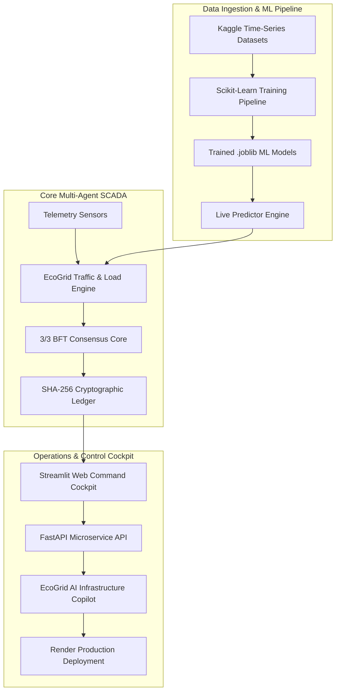

# ⚡ EcoGrid Core: Multi-Agent SCADA Infrastructure

```text
█▀▀▀▀▀▀▀▀▀▀▀▀▀▀▀▀▀▀▀▀▀▀▀▀▀▀▀▀▀▀▀▀▀▀▀▀▀▀▀▀▀▀▀▀▀▀▀▀▀▀▀▀▀▀▀▀▀▀▀▀▀▀▀▀▀█
█   ECOGRID CORE AI INFRASTRUCTURE SYSTEMS MANAGEMENT PANEL      █
█▄▄▄▄▄▄▄▄▄▄▄▄▄▄▄▄▄▄▄▄▄▄▄▄▄▄▄▄▄▄▄▄▄▄▄▄▄▄▄▄▄▄▄▄▄▄▄▄▄▄▄▄▄▄▄▄▄▄▄▄▄▄▄▄▄█
```

<p align="center">
  <a href="https://ecogrid-ai-cockpit.onrender.com/">
    
  </a>
  
  
  
  
  
  
  
  
</p>

---

## 🌐 Live Production Deployment

> [!IMPORTANT]
> 🚀 **Live Production Application:** [https://ecogrid-ai-cockpit.onrender.com/](https://ecogrid-ai-cockpit.onrender.com/)  
> 📖 **OpenAPI REST Swagger Documentation:** `http://localhost:8000/docs` (Local) / `https://ecogrid-ai-cockpit.onrender.com/docs` (Cloud)

---

## 🔬 System Overview

**EcoGrid Core** is a next-generation, containerized microgrid & smart city infrastructure platform designed to eliminate single-point vulnerabilities in modern power networks.

By replacing rigid centralized orchestrators with an autonomous **distributed multi-agent intelligence architecture**, EcoGrid establishes a self-healing grid secured by a **3/3 Byzantine Fault Tolerant (BFT) consensus core**, an **EcoGrid AI Infrastructure Copilot** (powered by Google Gemini 2.5 Flash & Edge AI), an **Instant Multi-Country Currency Switcher** across 10 international sectors, Machine Learning models trained on Kaggle time-series datasets, and a tamper-evident SHA-256 cryptographic audit ledger.

---

## 🏗️ System Architecture & Workflow Pipeline



### ⚙️ Protocol Execution Sequence

```
[ Telemetry Ingestion ] ──> [ ML Load/Traffic Prediction ] ──> [ 3/3 BFT Signature Vote ] ──> [ SHA-256 Block Seal ]
```

1. **Telemetry Capture:** Node sensors track voltage, EV charging demand, grid frequencies, and vehicle flow rates.
2. **Kaggle AI Prediction:** Scikit-Learn predictors compute Intersection Congestion Index (ICI), total kW load demand, and solar generation output.
3. **Consensus Verification:** Peer nodes cross-verify incoming parameters. Unanimous 3/3 signature voting approves state transitions or triggers cyber-attack containment.
4. **Cryptographic Locking:** Transactions compute a unique SHA-256 hash string, chaining directly to the local JSON and SQLite/PostgreSQL audit ledger.

---

## 🗂️ 8 Dedicated System Domain Tabs

The Streamlit Web Cockpit (`app.py`) provides 8 dedicated domain tabs:

| Tab Icon | Domain Tab | Technical Capabilities |
| :---: | :--- | :--- |
| ⚡ | **EcoGrid SCADA & Microgrid** | Multi-agent microgrid load balancing, battery SOC health, live sine-wave frequency stream monitors, and dynamic regional tariff savings. |
| 🚦 | **Smart City Traffic & EV Grid** | Intersection Congestion Index (ICI), adaptive green light timing optimization, emergency green wave corridor override, and EV charging queue load shedding. |
| 🌐 | **Multi-Country Currency Center** | Instant currency conversion and tariff comparison matrix across 10 international grid sectors (INR ₹, USD $, EUR €, GBP £, JPY ¥, AUD $, BRL R$, CAD $, UAE AED, ZAR R). |
| 🧠 | **AI Infrastructure Copilot** | AI Q&A Assistant providing detailed technical analyses, Executive Summaries, and bulleted engineering action plans. |
| 🤖 | **Kaggle AI & ML Model Hub** | Scikit-Learn model predictors, live prediction sandboxes, Kaggle dataset data explorer, and 1-click CSV dataset exporter. |
| 🛡️ | **Cybersecurity & 3/3 BFT Ledger** | Chaos Monkey threat injector, 3/3 BFT unanimous signature consensus evaluator, SHA-256 ledger explorer, and audit CSV exporter. |
| 📑 | **Incident Reports & Prescriptions** | Automated ground-level engineering prescriptions for on-site technicians and downloadable Markdown forensic incident reports. |
| 📡 | **REST API & System Telemetry** | Live FastAPI microservice endpoints matrix, OpenAPI Swagger UI link, and system deployment status. |

---

## 🌐 Instant Multi-Country Currency Matrix (10 Sectors)

Selecting any country in the sidebar instantly updates spot market rates, utility tariffs, and financial savings across the entire application:

| Sector Code | Country | Currency | Symbol | Base Tariff (/kWh) | INR Conversion Ratio |
| :---: | :--- | :---: | :---: | :---: | :---: |
| **IN** | India | INR | ₹ | ₹7.50 | 1.0 |
| **US** | United States | USD | $ | $0.18 | 0.012 |
| **EU** | European Union | EUR | € | €0.24 | 0.011 |
| **UK** | United Kingdom | GBP | £ | £0.35 | 0.0093 |
| **JP** | Japan | JPY | ¥ | ¥31.00 | 1.82 |
| **AU** | Australia | AUD | $ | $0.36 | 0.018 |
| **BR** | Brazil | BRL | R$ | R$0.75 | 0.068 |
| **CA** | Canada | CAD | $ | $0.16 | 0.016 |
| **UAE** | United Arab Emirates | AED | AED | AED 0.30 | 0.044 |
| **ZA** | South Africa | ZAR | R | R 3.20 | 0.22 |

---

## 🔑 Quick Login Presets (Demo Credentials)

| Role Preset | Username | Password | Access Level |
| :--- | :--- | :--- | :--- |
| **System Administrator** | `admin` | `Admin@123` | Full Administrative Access |
| **Microgrid Chief Engineer** | `grid_eng` | `Grid@123` | SCADA Energy Dispatch & Battery Storage |
| **Traffic Operations Chief** | `traffic_op` | `Traffic@123` | Smart City Traffic & EV Queue Control |
| **Guest Auditor** | `guest` | `Guest@123` | Read-only Ledger Verification |

---

## 🌐 FastAPI REST Microservice Endpoints

OpenAPI Swagger documentation is accessible at `http://localhost:8000/docs` or `https://ecogrid-ai-cockpit.onrender.com/docs`.

| Method | Endpoint | Description |
| :---: | :--- | :--- |
| `GET` | `/health` | System health, loaded ML models & database backend status |
| `POST` | `/api/v1/auth/register` | Register new user account with password policy check |
| `POST` | `/api/v1/auth/login` | Authenticate user credentials & issue session token |
| `POST` | `/api/v1/auth/demo-login` | 1-click Quick Demo Login preset |
| `POST` | `/api/v1/predict/traffic` | ML Traffic Congestion Index prediction |
| `POST` | `/api/v1/traffic/optimize-signal` | Adaptive Signal Timing Phase Allocation |
| `POST` | `/api/v1/traffic/ev-balance` | EV Charging Queue Load Shedding & Balancing |
| `POST` | `/api/v1/ai/copilot` | AI Copilot Q&A with Executive Summary & Action Plan |
| `POST` | `/api/v1/currency/convert` | Instant multi-country currency conversion |
| `POST` | `/api/v1/predict/load` | Live ML Grid Load demand prediction |
| `POST` | `/api/v1/scada/bft-consensus` | Evaluate 3/3 BFT Consensus vote on proposed action |
| `GET` | `/api/v1/ledger` | Verify SHA-256 ledger block chain integrity |
| `POST` | `/api/v1/ml/retrain` | Trigger automated Kaggle model retraining pipeline |

---

## 🚀 Deployment & Quickstart Guide

### Option 1: Local Setup

1. **Clone Repository & Install Dependencies:**
   ```bash
   git clone https://github.com/shambhushekharsinha-engg/ecogrid-core.git
   cd ecogrid-core
   pip install -r requirements.txt
   ```

2. **Train Kaggle Machine Learning Models:**
   ```bash
   python -m ml_engine.train_models
   ```

3. **Run Automated Test Suite:**
   ```bash
   python -m pytest tests/test_suite.py
   ```

4. **Launch Application Services:**
   - **Streamlit Web UI Command Cockpit (Port 8501):**
     ```bash
     streamlit run app.py
     ```
   - **FastAPI REST API Server (Port 8000):**
     ```bash
     uvicorn api.server:app --reload --port 8000
     ```

### Option 2: Containerized Docker Deployment

```bash
docker-compose up --build
```
Access the Streamlit Command Cockpit at `http://localhost:8501` and FastAPI OpenAPI Docs at `http://localhost:8000/docs`.

---

## 👤 Developer Profile

**Developed by Shambhu Shekhar Sinha**, Computer Science & Engineering student specializing in Artificial Intelligence and Machine Learning.

### 📄 License
Licensed under the [MIT License](LICENSE).
